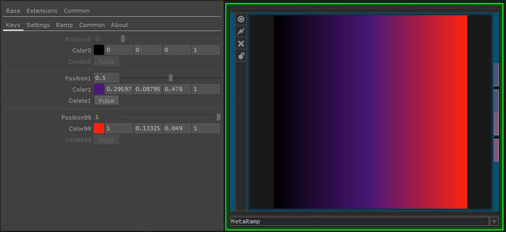

# meta_ramp
 Touchdesigner component. A meta ramp top where all keys are controlled by parameters that can be referenced or controlled using chops :). Ideal for making dynamic ramps easily.

[OLIB LINK](https://olib.amb-service.net/component/meta-ramp)
* See OLIB for longer description and detailed parameter explanation

 

